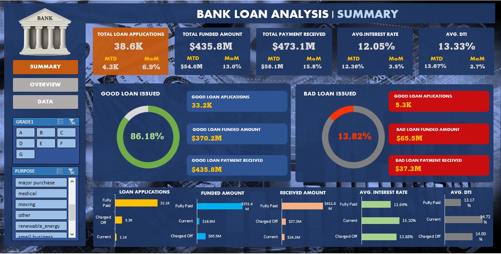
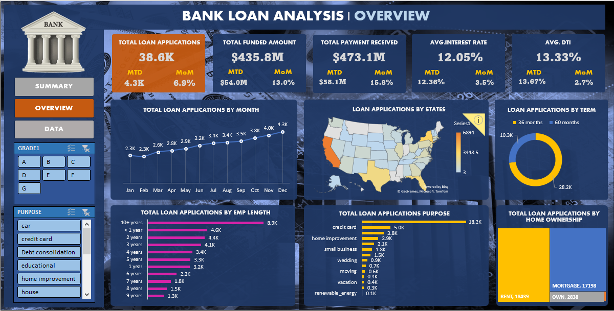

# Bank-loan-Analysis-Excel-Project
🎯 Project Objective : The objective of your Excel project is to comprehensively analyze bank loan data by tracking key performance indicators (KPIs) such as  total loan applications, funded amounts, received amounts, average interest rates, and debt-to-income ratios (DTI) aiding in understanding loan trends and patterns.

Summary Report :

Overview Report :

🔧 Project Process -->

🛠️ Tools Used :

A- Excel 
1.
2.
3.
4.

📊 Insights Generation :
